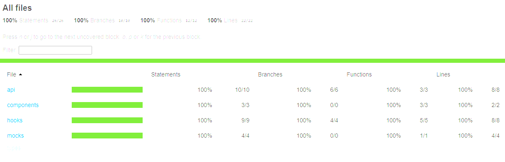

## Testabdeckung

## Tests

- 18 Tests, 3 Test-Suiten
- API-Tests mit MSW (Mock Service Worker)
- Hook-Tests mit renderHook
- Component-Tests mit React Testing Library
- 100% Coverage: Statements, Branches, Functions, Lines

## Teststrategie

Jede Schicht der App wird isoliert getestet:

- `quizApi.ts` – pure functions und API-Fehlerszenarien
- `useQuiz.ts` – Spiellogik und State-Übergänge
- `Question.tsx` – Rendering und User-Interaktion

Externe Abhängigkeiten (API) werden mit MSW gemockt –
Tests laufen ohne Internet und immer deterministisch.

## Starten

npm install
npm test
npm run test:coverage
